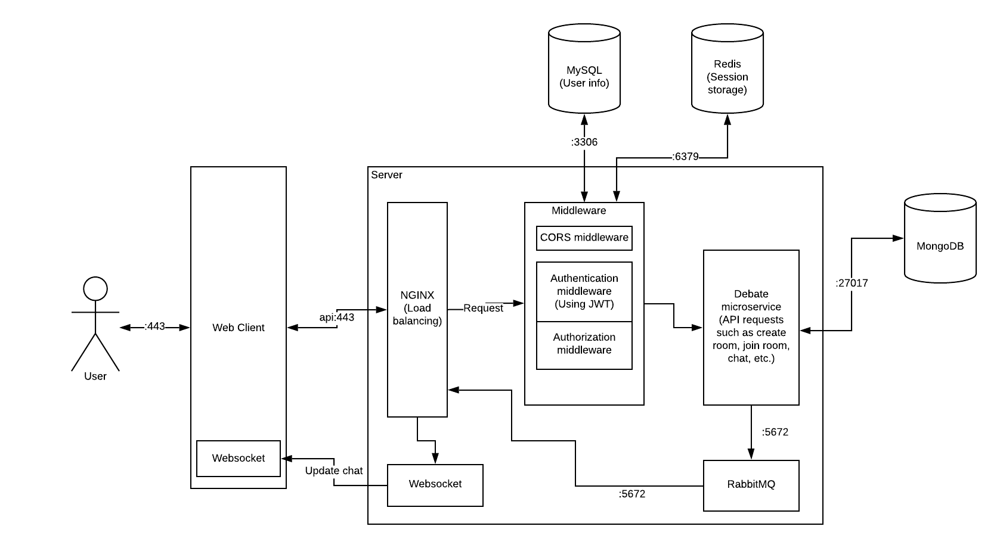

# Master Debater
By Boya Cao, Brandon Chong, Yvonne Liu, Leon Tan
## Project Description 
We plan to build an online debating web application to let all people  debate with one another on the internet over any topic they want. A new debate will be generated by the server every hour. Debates will last for a total of an hour. In the debate room, debaters will debate in a free-for-all, where pure chaos is the goal.

Our target audiences including people of any background and experience that wish to develop and test their knowledge across a wide span of topics, in debate form. For this audience, Master debater will be a great way to meet more people, both like-minded and opposite-minded, on the internet. By debating, we hope to help people of all ages to expand their thinking horizon, so that they can be more informed in their decisions.

Additionally, arguing with people in real life can be difficult because it is often difficult confronting others about their opinions. Also, a person's reputation can be damaged or a good relationship can be ruined due to a debate. But with Master Debater users can choose to debate anonymously (hidden behind a username) that would not affect them (unless their username was identifiable). By using Master Debater, we hope that the skills of debating, questioning, and collaborative brainstorming will transfer to real life and make the users better team players.

From a utilitarian perspective the joy that these people generate from each other is a moral good and enabling them to fight with each other is just. We want to make the world a better place by educating others on various different topics.
 
## Technical Description
### Infrastructure
The system will heavily rely on Docker containers to isolate the client, server, and database. Users will only interact with the client, and the server will perform all the required actions to provide a seamless user experience for debating.

https://www.lucidchart.com/invitations/accept/c719ef91-0be0-462c-9432-0dbcb8a6383c

### User Stories
|Priority|User|Description|
|--------|----|-----------|
|P0|As a debater|I want to filter out chatrooms with my favoured topics. I want to be able to post within chat rooms. I want to see my mailbox for new messages. API routes: <ul><li>GET /v2/openchannels</li><li>POST /v1/channels/{id}</li></ul>|
|P1|As a student|I want to watch people debate. API routes: <ul><li>GET /v2/openchannels</li><li>POST /v1/channels/{id}</li></ul>|

### API Design

- **/v1/users**: POST new user
    - POST: Create new user
        - “200”: “application/json” - successfully created a new user, logs them in, and returns their information in JSON format.
        - “400”: “error” - “error” - cannot read body or incorrect body
        - “500”: “error” - internal server error
- **/v1/users/**: user control - GET current user information, PATCH update user information
    - GET: Get current user information
        - “200”: “application/json” - successfully got current user’s information and returns user information in JSON format.
        - “401”: “error” - cannot verify the current user
        - “500”: “error” - internal server error
    - PATCH: Update user information
        - “201”: “application/json” - successfully deleted current user’s information
        - “401”: “error” - cannot verify the current user
        - "415": "error" - content-type must be application/json
        - “500”: “error” - internal server error
- **/v1/sessions**: POST login and create new session
    - POST: Login user and create new session for user with their credentials
        - “200”: “application/json” - successfully logs user in, and returns their information in JSON format.
        - “400”: “error” - bad request
        - "405": "error" - method not allowed
        - "415": "error" - content-type must be application/json
        - “500”: “error” - internal server error
**/v1/sessions/**: DELETE session
    - DELETE: Close existing session.
        - “200”: “application/json” - successfully created a new user, logs them in, and returns their information in JSON format.
        - “403”: “error” - forbidden
        - “405”: “error” - method not allowed
        - “500”: “error” - internal server error
- **/v2/openchannels**: GET a list of all current debates
    - GET: Get all current debates
        - “200”: “application/json” - successfully got all current debates and returns them in JSON format as { id, name }
        - “500”: “error” - internal server error
- **/v1/channels**: POST create a debate
    - POST: create a debate
        - “200”: “application/json” - successfully created
        - “401”: “error” - cannot verify the current user
        - “500”: “error” - internal server error
- **/v1/channels/{id}**: POST a message
    - POST: Post a message
        - “200”: “application/json” - successfully posted a message
        - “401”: “error” - cannot verify the current user
        - “500”: “error” - internal server error